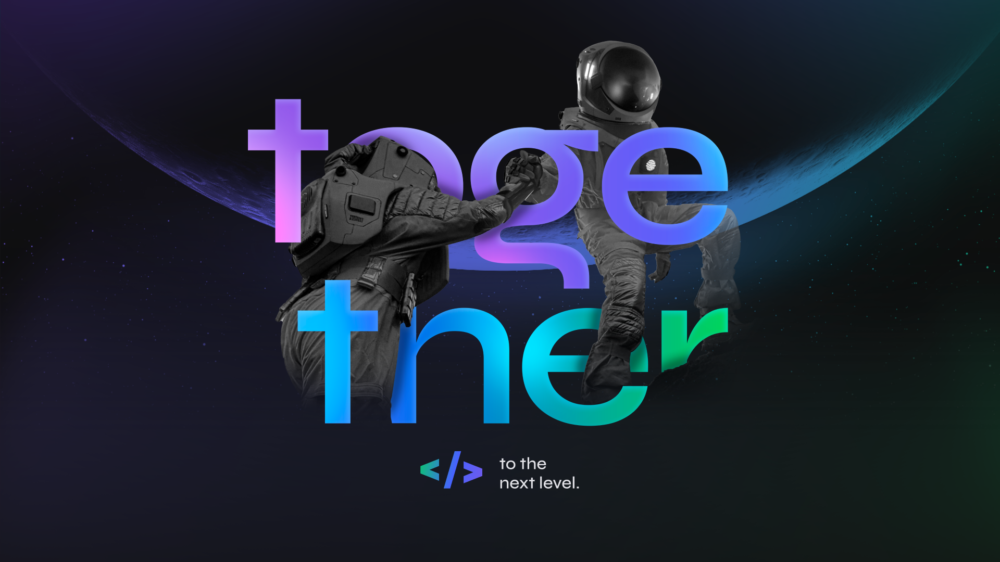

<h1 align="center"></h1>

Olá! Seja bem-vindo ao meu repositório do projeto Rocket.Q desenvolvido na NWL/Together da Rocketseat. O projeto desenvolvido é uma sala de perguntas e respostas.
Na aplicação o usuário pode criar uma sala ou participar de uma, e quando estiver presente na sala, pode fazer perguntas de forma anônima. O criador da sala pode gerenciar essas perguntas marcando como lidas ou as deletando.

<h2 align="center"> :rocket: Tecnologias Utilizadas :rocket:</h2>

  
  
  
  
  

<h2 align="center"> :computer: Demonstração do Projeto :computer:</h2>

<h3 align="center">Criando uma sala</h3>

<h3 align="center">Copiando a senha da sala</h3>

<h3 align="center">Saindo da sala e entranado novamente com a senha</h3>

<h3 align="center">Fazendo perguntas</h3>

<h3 align="center">Escolhendo uma cor de fundo</h3>

<h3 align="center">Marcando uma pergunta como lida</h3>

<h3 align="center">Deletando uma pergunta</h3>

#### Instruções de instalação

    # Clonar o repositório
    $ git clone https://github.com/matheusz98/rocket.q

    # Ou
    # Ir no code (botãozinho verde) e fazer download do zip.

    # Entrar na pasta da aplicação
    $ cd rocketq

    # Instalar as dependências
    $ npm install

    # Iniciar o servidor
    $ npm start
    
<h2 align="center">Curtiu o repositório? Fique a vontade para fazer uso dele! :grin:</h2>
<h2 align="center">Muito obrigado pela visita! :smile: :grinning: </h2>
